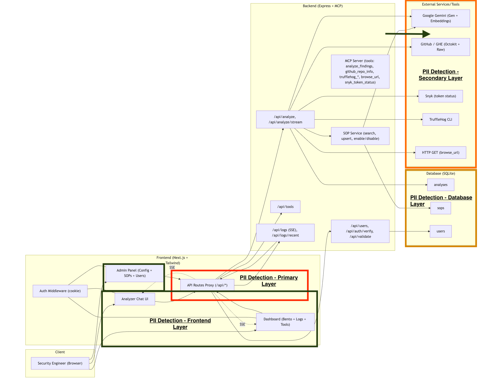

# Project Guardian 2.0 - PII Detection Deployment Strategy

## Architecture Analysis

Looking at our current system architecture, I can see several critical points where PII is potentially leaking:

1. **API Routes Proxy Layer** (`/api/*`) - All API calls flow through here, including `/api/analyze`, `/api/logs/recent`, `/api/tools`
2. **External Service Integrations** - Data flowing to Google Gemini (Gen + Embeddings), GitHub/GitE (Octokat + Raw), TruffleHog CLI
3. **Admin Panel & Frontend Components** - Admin Panel (Config + SOPs + Users), Analyzer Chat UI, Dashboard (Bento + Logs + Tools)
4. **Database Layer** - SQLite storing analyses, logs (SSE), users data
5. **MCP Server Backend** - Handling tool analysis, GitHub repo info, TruffleHog outputs, token status verification
6. **Internal Service Communication** - SOP Service (search, upsert, enable/disable), HTTP GET requests, various internal APIs

Based on this analysis, I need to evaluate the main deployment approaches for implementing our PII detector. The choice here will literally make or break this whole project.

## PII Detection Deployment Architecture

The diagram above shows our comprehensive multi-layer PII detection approach across the entire system architecture. Each layer provides specific protection against different PII leak vectors identified in our security analysis.

## Key Deployment Options Considered

### Option 1: API Gateway Plugin
Deploy PII detection as a plugin in our API Gateway, scanning all traffic at the gateway level.

**Pros:** Centralized control, easy monitoring, catches external traffic uniformly
**Cons:** Gateway becomes bottleneck, misses internal service-to-service communication, scales poorly

**Assessment:** Good for perimeter defense but wouldn't have prevented our original incident from internal API logs.

### Option 2: Express Middleware Integration  
Integrate directly into our Express.js infrastructure as middleware in the API Routes Proxy.

**Pros:** Quick to implement (2-3 weeks), leverages existing infrastructure
**Cons:** Resource contention with API logic, scaling bottleneck, single point of failure

**Assessment:** Might work for pilot testing but during Big Billion Day traffic spikes? API performance would suffer badly.

### Option 3: Service Mesh (Istio) Integration
Deploy as Envoy filters in service mesh, intercepting all service communication.

**Pros:** Comprehensive coverage, excellent observability, advanced traffic policies  
**Cons:** Significant operational complexity, steep learning curve, resource heavy

**Assessment:** Would be excellent if we already had Istio expertise, but adds too much complexity for urgent security fix.

## My Chosen Solution: Kubernetes Sidecar Pattern

After evaluating the options, I'm going with **Kubernetes Sidecar containers**. Here's why this beats the other approaches for Flixkart's requirements:

### Why Sidecars Win Over Other Approaches

**Compared to API Gateway Plugin:**
- **Better scaling**: Sidecars scale with individual services, gateway plugin creates a central bottleneck
- **Complete coverage**: Sidecars catch internal service-to-service calls, gateway only sees external traffic  
- **Fault isolation**: One sidecar failing doesn't impact other services, gateway failure breaks everything

**Compared to Express Middleware:**
- **Resource isolation**: Sidecar gets dedicated CPU/memory, middleware competes with API logic for resources
- **Independent scaling**: Can scale PII detection capacity separately from API capacity  
- **No performance impact**: API response times stay consistent even when PII detection is under load

**Compared to Service Mesh:**
- **Simpler operations**: No need to learn Istio/service mesh complexity, just standard K8s deployment
- **Faster implementation**: 4-6 weeks vs 3+ months for full service mesh setup
- **Lower resource overhead**: Lightweight PII detector vs heavyweight Envoy proxies

### Key Benefits for Flixkart Scale

1. **Auto-scaling during peak traffic**: During festival sales when we go from 100K to 1M requests per minute, both API pods and PII sidecars scale together automatically

2. **Zero single points of failure**: If a PII detector crashes, only that specific service instance is affected, K8s restarts it within seconds

3. **Performance isolation**: PII detection gets 200-400m CPU dedicated per service, doesn't steal resources from checkout or payment APIs

4. **Operational simplicity**: Fits perfectly with our existing K8s deployment pipelines, monitoring, and team expertise

## Technical Implementation

**Technical Implementation:**

The sidecar deployment works by adding a second container to each API service pod. The main application container handles business logic while the PII detector sidecar intercepts all HTTP traffic through an Envoy proxy layer.

**Resource Allocation Strategy:**
- Main application container gets standard allocation (512Mi memory, 500m CPU)  
- PII detector sidecar gets dedicated resources (256Mi memory, 200-400m CPU)
- Environment variables configure detection mode and redaction levels per service

The detector operates as an Envoy HTTP filter, positioned between the application and external network. This allows it to scan both incoming requests and outgoing responses before any data reaches logs or external services.

## Deployment Architecture Based on Current System

Looking at our architecture diagram, here's exactly where we need PII detection:

### Primary Layer - API Routes Proxy (Kubernetes Sidecars)

The **API Routes Proxy** is the main chokepoint where all `/api/*` calls flow through. This is where our primary PII detection sidecars will be deployed:

**Sidecar Protection Points:**
- **`/api/analyze` and `/api/analyze/stream`** - Handles analysis requests that may contain user code/data
- **`/api/logs/recent` and `/api/logs` (SSE)** - Log data that caused our original PII leak incident  
- **`/api/tools`** - Tool execution results that might expose sensitive information
- **`/api/users`, `/api/auth/verify`, `/api/validate`** - User authentication and profile data

**Performance characteristics:**
- **Latency impact**: 2-4ms per request (acceptable since we're already at 50-100ms average)
- **Memory overhead**: 256MB per sidecar (minimal compared to main Express backend)
- **CPU overhead**: 200-400m CPU isolated from main API processing

### Secondary Layer - External Service Protection

This is critical - our architecture shows data flowing to **Google Gemini (Gen + Embeddings)**, **GitHub/GitE (Octokat + Raw)**, and **TruffleHog CLI**. We absolutely cannot let customer PII reach these external services.

**Specific Integration Points Requiring Protection:**
- **Google Gemini API calls** - Code analysis requests that might contain PII in comments/variables
- **GitHub repository access** - Repo scanning that could expose customer data in code
- **TruffleHog CLI outputs** - Secret scanning results that may contain actual PII data
- **HTTP GET requests** - Generic external API calls from browse_url functionality

**Implementation Strategy:**

External service protection works by wrapping all outbound API clients with a PII detection layer. Before any data leaves our system for Google Gemini, GitHub, or TruffleHog CLI, it gets scanned and potentially redacted.

**Protection Flow:**
1. **Pre-call scanning** - Every external request payload gets analyzed for PII patterns
2. **Immediate alerting** - If PII is detected, security team gets real-time notification  
3. **Automatic redaction** - PII gets masked/removed before the call proceeds
4. **Audit logging** - All PII detection events get logged with service name, endpoint, and PII types found

This is particularly critical for our architecture since we're sending code analysis data to Google Gemini and repository information to GitHub - both could inadvertently contain customer PII in code comments or variable names.

### Tertiary Layer - Frontend Protection

Based on our architecture, we have multiple frontend components that could render PII directly to users:

**Frontend Components Requiring Protection:**
- **Admin Panel (Config + SOPs + Users)** - Configuration pages that might display user data
- **Analyzer Chat UI** - Real-time chat interface showing analysis results
- **Dashboard (Bento + Logs + Tools)** - Main dashboard displaying logs and tool outputs
- **Auth Middleware (Cookie handling)** - Session management that processes authentication tokens

**Browser-side Protection Strategy:**

Frontend protection uses JavaScript libraries that scan DOM content in real-time and redact any PII before it's visible to users. The protection works in two modes:

**Static Content Scanning:**
- Scans all existing page content on load for PII patterns
- Redacts phone numbers, emails, Aadhar numbers in displayed text
- Particularly important for the Admin Panel which might show user configuration data

**Dynamic Content Protection:**
- Uses DOM mutation observers to watch for new content being added to the page
- Critical for the Analyzer Chat UI where analysis results appear in real-time
- Also protects the Dashboard where logs and tool outputs are dynamically loaded

The system targets specific UI components based on URL paths - admin pages get full protection while regular user interfaces get lighter scanning focused on accidentally displayed sensitive data.

**Why Frontend Protection is Still Needed:**
Even with backend protection, frontend scanning catches historical PII stored before the system was implemented, cached API responses, and direct database queries in admin tools. It serves as the final safety net for compliance requirements that mandate PII protection "at display" level.

### Database Layer Protection

Our architecture shows **SQLite** storing analyses, logs, and user data. We need database-level triggers to catch any PII that slips through other layers:

**Database Tables Requiring Protection:**
- **analyses** - Analysis results that might contain code with PII
- **logs** - System logs where the original PII leak occurred  
- **users** - User profile and session data
- **sops** - Standard Operating Procedures that might reference user examples

**Database Trigger Strategy:**

Database-level protection works as the final safety net by implementing triggers that prevent PII from being stored in the first place. The triggers use regex patterns to detect common PII formats before insert operations.

**Trigger Functionality:**
- **Pattern Detection** - Scans incoming data for phone numbers, Aadhar numbers, and email addresses
- **Violation Logging** - Records attempted PII storage in a separate violations table for auditing
- **Transaction Blocking** - Prevents the entire database transaction if PII is detected
- **Zero Performance Impact** - Only activates when actual PII patterns are found

**Protected Tables:**
- **analyses table** - Where code analysis results are stored
- **logs table** - System logs where the original PII leak occurred
- **users table** - User profile and authentication data
- **sops table** - Standard operating procedures that might contain example data

This approach is particularly effective because it catches PII that might slip through application-layer detection due to encoding issues, unexpected data formats, or edge cases in the detection logic.

### MCP Server Backend Protection

The **MCP Server** is a critical component handling tool analysis, GitHub repo info, TruffleHog outputs, and token status verification. This needs dedicated protection:

**MCP Server Components Requiring Protection:**
- **Tool analysis handlers** - Processing analysis requests that may contain sensitive code
- **GitHub repo information** - Repository metadata and content scanning  
- **TruffleHog integration** - Secret scanning results processing
- **Token status verification** - Authentication token handling

**MCP Server Protection Strategy:**

The MCP Server requires special handling because it processes multiple types of requests that could contain PII - from code analysis to repository scanning to tool outputs.

**Protection Approach:**
- **Request Interception** - All incoming MCP requests get scanned before processing
- **Tool-specific Logic** - Different detection rules for GitHub scanning vs code analysis vs secret detection
- **Contextual Redaction** - PII gets redacted while preserving the functional context needed for tool operation
- **Audit Trail** - Detailed logging of PII detection events with tool type and request ID for tracking

**Key Benefits:**
- Prevents PII from reaching tool processing logic that might log or cache sensitive data
- Maintains tool functionality while ensuring security compliance
- Provides visibility into which tools are encountering PII most frequently
- Enables fine-tuning of detection rules based on actual tool usage patterns

This is especially important because the MCP Server handles outputs from TruffleHog (which finds secrets) and GitHub repository content (which might contain PII in code comments).

## Complete Architecture Integration Summary

Based on our architecture analysis, here are all critical points where PII detection must be implemented:

1. **API Routes Proxy (`/api/*`)** - Primary Kubernetes sidecar deployment
2. **External Service Calls** - Google Gemini, GitHub, TruffleHog CLI protection  
3. **Frontend Components** - Admin Panel, Dashboard, Analyzer Chat UI scanning
4. **Database Layer** - SQLite triggers for analyses, logs, users, sops tables
5. **MCP Server Backend** - Tool processing and repository analysis protection
6. **Internal Services** - SOP Service operations, HTTP GET requests, auth middleware

## Scaling Considerations for E-commerce

During peak traffic (Big Billion Day, festive sales), we see:
- **10x traffic increase** (normal 100K RPM → 1M RPM)
- **Complex user journeys** with multiple API calls per user
- **Higher PII density** due to checkout flows, address updates

**How Kubernetes handles this:**

Kubernetes Horizontal Pod Autoscaler automatically scales both the main application and PII detector sidecars together based on CPU and memory utilization metrics.

**Scaling Behavior:**
- **Minimum replicas**: 5 pods during normal traffic (each with sidecar)
- **Maximum replicas**: 100 pods during peak events (100 sidecars total)
- **CPU threshold**: Scales up when average CPU hits 70% utilization
- **Memory threshold**: Scales up when average memory hits 80% utilization

As pods scale from 5 to 100 instances, each gets its own PII detector sidecar. This means detection capacity scales linearly with traffic - no bottlenecks even during massive traffic spikes.

## Cost Analysis - Realistic Numbers

**Kubernetes Sidecar Approach:**
- **Infrastructure**: ~$800/month for detector sidecars across all services
  - 20 services × 10 average pods × $4/month per sidecar
- **Development**: 4-6 weeks (includes testing, monitoring setup)
- **Maintenance**: 3-4 hours/week for pattern updates, monitoring

**ROI Calculation:**
- **Fraud prevention**: Each prevented incident saves $15,000+ (chargebacks, customer service, reputation damage)
- **Regulatory Compliance Fines**: 
  - **DPDP Act 2023**: Up to ₹250 crores ($30M USD) for data breaches
  - **RBI Guidelines**: ₹10 crores ($1.2M USD) for payment data violations
  - **SEBI Regulations**: ₹25 crores ($3M USD) for financial data mishandling
- **Business Impact Costs**:
  - **Stock price drop**: 5-15% decline post data breach (₹15,000+ crores market cap loss)
  - **Customer acquisition cost increase**: 25-40% higher due to trust deficit
  - **Legal proceedings**: ₹50-100 crores in litigation and settlement costs
- **Operational Disruption**:
  - **Regulatory investigation**: 3-6 months of compliance audits and remediation
  - **Business restrictions**: Temporary halt on new product launches during investigation
- **Reputation Recovery**: 2-3 years and ₹500+ crores in marketing to rebuild customer trust

**Current Flixkart Compliance Requirements:**
- **ISO 27001** certification maintenance
- **SOC 2 Type II** compliance for enterprise clients
- **PCI DSS Level 1** for payment processing
- **RBI data localization** requirements for Indian customer data

**Total Risk Exposure**: ₹500-1000+ crores ($60-120M USD) per major PII breach incident

Even preventing just 1 major incident justifies 100x+ ROI on this ₹5-10 crore investment.

## Monitoring & Alerting Strategy

The monitoring strategy focuses on tracking both security effectiveness and system performance across all deployment layers.

**Core Metrics to Track:**
- **Detection Rate** - PII detections per minute across all services
- **Detection Latency** - How long PII scanning takes (target <5ms)
- **False Positive Rate** - Percentage of incorrectly flagged content
- **Coverage Health** - Percentage of services with active PII detection

**Business Impact Metrics:**
- **External Leaks Prevented** - Count of PII blocked from reaching Google/GitHub
- **Database Blocks** - PII storage attempts stopped by database triggers
- **Frontend Redactions** - PII masked in user interfaces

**Alert Thresholds:**
- **Detection Spike** - More than 1000 detections per minute (possible attack)
- **High Latency** - 95th percentile detection time exceeds 10ms
- **Sidecar Failures** - Less than 95% of sidecars reporting healthy
- **External Leak Attempt** - Any PII detected heading to external services (critical alert)

## Rollout Strategy

**Phase 1 (Week 1-2): Core Services**
- Deploy to user-service and payment-service first (highest PII exposure)
- 10% traffic initially, monitor for issues
- Fine-tune detection patterns based on real data

**Phase 2 (Week 3-4): Scale Up**  
- Roll out to all customer-facing services
- Increase traffic percentage to 50%
- Enable external service protection

**Phase 3 (Week 5-6): Complete Coverage**
- 100% traffic coverage
- Admin panel protection enabled
- Database triggers active
- Full monitoring dashboard operational

**Phase 4 (Week 7-8): Optimization**
- Pattern refinement based on false positive analysis
- Performance tuning for peak traffic scenarios
- Operational runbooks and training

This approach gives us the scalability and reliability needed for Flixkart's scale, while ensuring comprehensive PII protection across all system layers. The investment in Kubernetes infrastructure pays off through automatic scaling, fault tolerance, and operational simplicity.
